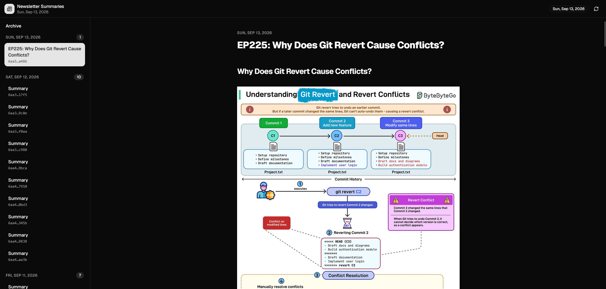
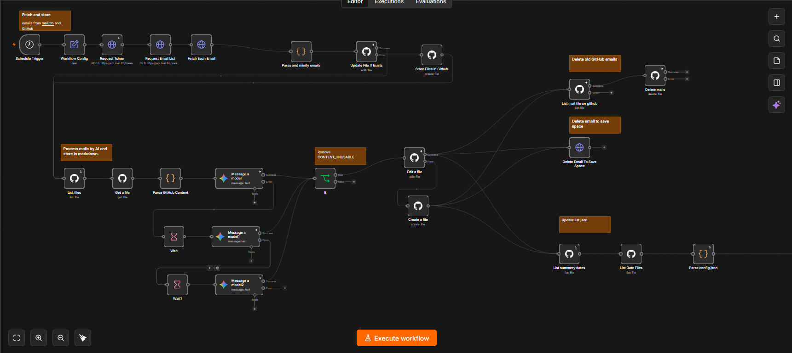

# AI Newsletter Summarizer 🚀

Welcome to the **AI Newsletter Summarizer**!

Are you tired of cluttered inboxes full of newsletters that you don't have time to read? Do you wish you could just get the main points without scrolling through ads, promotions, and irrelevant content?


<div align="center">
  
</div>

________________________


<div align="center">
  
</div>

_______________


**This project is the solution.**

The AI Newsletter Summarizer is a modern, offline-first web application built with React and Vite that reads AI-generated summaries of your favorite newsletters. It uses the power of Google Gemini AI and n8n automation to fetch, clean, and summarize your emails, giving you a clean, distraction-free reading experience.

### 🔥 See it in action!
Check out our live demo: [AI Newsletter Summarizer Demo](https://amirrezadev1378.github.io/ai-newsletter-summarizer)

---

## 💡 The Problem It Solves

Modern newsletters are often bloated with:
- Heavy promotional content and advertisements.
- Long-winded introductions.
- Unwanted filler text and tracker links.

This project automatically intercepts your newsletters, strips away the junk, and uses AI to distill the content down to exactly what you need to know. The result is a concise, easy-to-read summary delivered straight to a beautiful, distraction-free web app.

---

## ⚙️ How It Works (The n8n Workflow)

The magic behind the scenes is powered by an n8n workflow. This automated process:
1. Fetches your newsletter emails.
2. Cleans up the HTML.
3. Uses Google Gemini AI to generate a clean, ad-free Markdown summary.
4. Pushes the summaries straight to this GitHub repository.

👉 **[Click here to view the full n8n Workflow Instructions & Setup Guide](n8n/README.md)**

---

## ✨ Features

- **Progressive Web App (PWA):** Fully installable on your device. It works offline and offers a snappy, native-app-like experience.
- **Offline Reading:** It intelligently caches articles and your newsletter list, meaning you can catch up on your reading even on a plane or without an internet connection.
- **Clean, Distraction-Free UI:** Built with Tailwind CSS and Radix UI primitives (via Shadcn UI) for a beautiful, responsive, and minimalist design.
- **Markdown Support:** Renders the AI-generated Markdown summaries perfectly.
- **Dark Mode:** Automatically respects your system's color scheme preferences to save your eyes at night.

---

## 🏗️ Project Structure

- `newsletter-client/`: The heart of the frontend application.
  - Built with React, React Router v7, Vite, Tailwind CSS v4, and Vite PWA.
- `api/`: Contains the API data (such as the `list.json` manifest generated by the workflow).
- `summerized/`: Contains the actual Markdown files of your summarized newsletters.
- `n8n/`: Contains the automated workflow configuration and instructions.

---

## 🚀 Setup Instructions

### Prerequisites

You'll need to have [Bun](https://bun.sh/) installed (it acts as our JavaScript runtime, package manager, and bundler).

### Installation

1. **Clone the repository:**
   ```bash
   git clone https://github.com/your-username/ai-newsletter-summarizer.git
   cd ai-newsletter-summarizer/newsletter-client
   ```

2. **Install dependencies:**
   ```bash
   bun install
   ```

3. **Configure environment variables:**
   Copy the example environment file and set the correct API base URL.
   ```bash
   cp .env.example .env.local
   ```

4. **Start the development server:**
   ```bash
   bun run dev
   ```

---

## 🛠️ Building for Production

To build the client application for production, simply run:

```bash
cd newsletter-client
bun run build
```

This will generate the static assets in the `build/client` directory, ready to be deployed.

---

## 🌍 Deployment

This project uses GitHub Actions for seamless deployment to GitHub Pages. The deployment workflow is located in `.github/workflows/github-pages.yml` and is configured to trigger manually via `workflow_dispatch`.

1. Go to the **Actions** tab in your GitHub repository.
2. Select the **GitHub Pages** workflow from the left sidebar.
3. Click on **Run workflow** to trigger a fresh deployment to your live site.

---

## 📶 Offline Capabilities (PWA Details)

The application uses Workbox to aggressively cache network requests. It specifically targets requests made to `raw.githubusercontent.com` (which serves the newsletter JSON data and Markdown articles). This robust caching strategy guarantees that you can read any previously fetched newsletters smoothly, even when your device goes completely offline.
